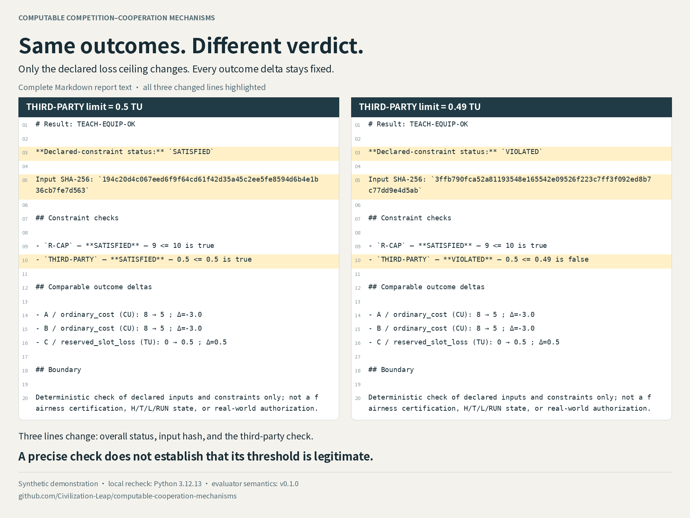
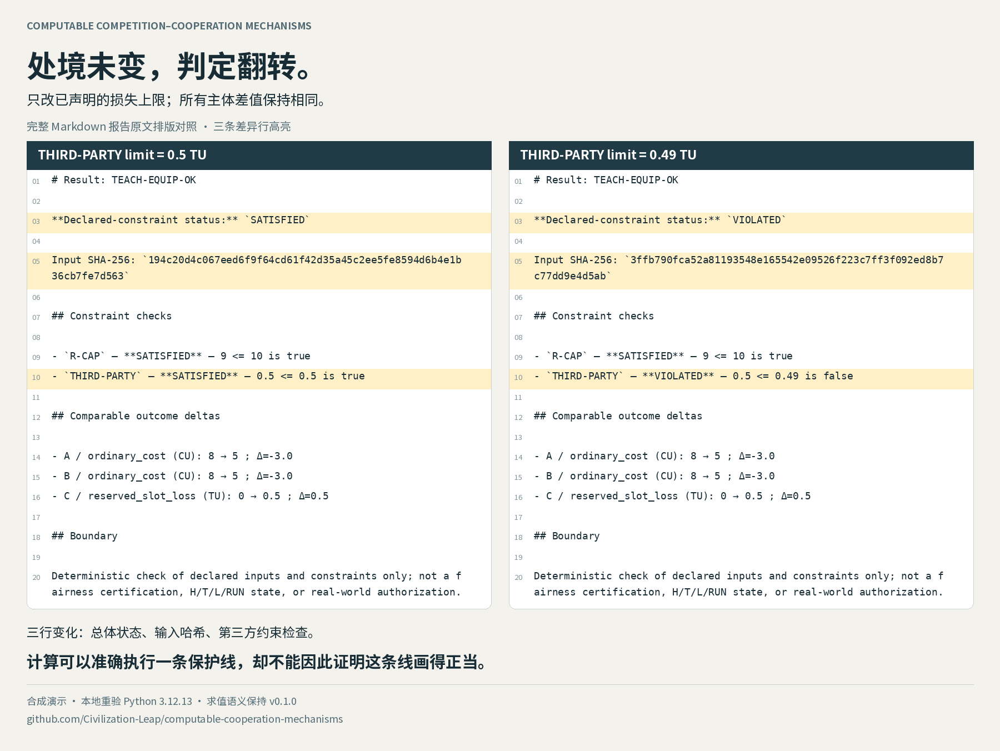

# Same outcomes. Different verdict.

Synthetic threshold-sensitivity demonstration · 2026-09-08 · evaluator semantics unchanged from v0.1.0.

## 中文传播稿

一个共享设备的合成算例：A、B 的成本各从 8 降到 5 CU，第三方 C 的预留时段损失为 0.5 TU。把第三方损失上限从 1 依次调到 0.6、0.5、0.49，只改这一个数字。前三次满足约束，0.49 时翻转为 `VIOLATED`。

整个扫描中，A、B 各节省 3 CU，C 始终损失 0.5 TU。变的是保护线，以及这份损失是否越线的判定。完整报告中的状态、输入哈希和比较理由随之变化，三条主体差值完全相同。

**计算可以准确执行一条保护线，却不能因此证明这条线画得正当。** 这个输入没有记录谁设定上限、C 是否参与、谁有权修改或提出异议。程序能算出是否越线；这些问题仍需回答。

取得源码和扫描脚本后，可在本地五分钟复现，无需 pip、网络或密钥。

## English shareable copy

A synthetic shared-equipment case: A and B each cut their declared cost from 8 to 5 CU; third party C incurs 0.5 TU of reserved-slot loss. Lower the declared ceiling from 1 to 0.6, then 0.5, then 0.49. Change nothing else. The first three satisfy the constraints. At 0.49, the result flips to `VIOLATED`.

Throughout the sweep, A and B each save 3 CU and C loses 0.5 TU. Only the protection line moves, changing whether that loss crosses it. The full reports differ in status, input hash, and comparison reason; all three outcome deltas are identical.

**A computation can enforce a line precisely without establishing that the line is legitimate.** This input does not record who set the ceiling, whether C participated, or who can amend or contest it. The checker answers whether the line was crossed. Those questions remain open.

Reproducible locally in five minutes once the source and sweep script are downloaded. No pip, network, or keys needed to run.

Repository: https://github.com/Civilization-Leap/computable-cooperation-mechanisms

## Exact experiment

| THIRD-PARTY limit (TU) | A delta (CU) | B delta (CU) | C delta (TU) | Overall declared-constraint status |
|---|---:|---:|---:|---|
| 1 | -3.0 | -3.0 | +0.5 | SATISFIED |
| 0.6 | -3.0 | -3.0 | +0.5 | SATISFIED |
| 0.5 | -3.0 | -3.0 | +0.5 | SATISFIED |
| 0.49 | -3.0 | -3.0 | +0.5 | VIOLATED |
| 0.25 | -3.0 | -3.0 | +0.5 | VIOLATED |

The boundary is inclusive: for this fixed 0.5 loss and `<=` rule, the third-party check is satisfied at limits of at least 0.5, and violated below 0.5. Lowering a loss ceiling makes the protection stricter. It changes acceptance under the declared rule, not C's supplied outcome. CU and TU remain separate units.

The experiment changes only `constraints[THIRD-PARTY].limit`; case ID, title, actors, outcomes, and other constraints are preserved. The original free-text description still mentions 1 TU. It is deliberately retained for the one-field experiment; executable `operator` and `limit` determine the check. This also exposes why descriptions and executable rules need consistency review in a practical workflow.

## Reproduce

From a checkout containing this change (the script and new CLI flags are not in the frozen v0.1.0 tag):

```bash
python scripts/threshold_sweep.py
```

To repeat against an existing v0.1.0 checkout, copy just `scripts/threshold_sweep.py` into its `scripts` directory and run that command. The evaluator and fixtures need no changes.

The script writes all five inputs, machine-readable results, full Markdown reports, `sweep.csv`, `reports.diff`, and `provenance.json` under `outputs/threshold_sweep`. It uses only the standard library.





These are typeset comparisons of the complete generated Markdown report text. Companion HTML files in assets allow the same text to be inspected in a browser. Only layout, line wrapping, and highlights are added; neither hashes nor differing lines are removed. The images compare adjacent sampled limits 0.5 and 0.49. Exactly three report lines change: 3 (overall status), 5 (input SHA-256), and 10 (third-party check). The hash is over normalized input JSON, not the raw input-file bytes.

## Interpretation and use

This is an executable illustration of threshold dependence, not an empirical discovery, behavioral prediction, or proof that cooperation is good or bad. Holding outcomes constant isolates the consequence of changing a declared rule. Moving the line is itself a rule change even though the supplied outcomes do not change.

The example does not establish that C was excluded from setting the threshold, that a contract exists or was breached, or that only C is affected by the overall verdict. It exposes missing provenance for the rule. A downstream application should explain who supplies a threshold, what justifies it, whose interests it protects, and how affected parties can contest it. Those are questions for further design, not features implemented here.

For researcher outreach, the key statement is simply `limit < 0.5`: the arithmetic is elementary; the question concerns the origin and justification of the threshold. For civic-tech readers, retain 0.49 and the runnable command. For HN, treat this file as factual preparation and follow the [author-writing guidance](OUTREACH_KIT.md#show-hn-preparation-notes--author-written-submission-required).

## Reproduction provenance

| Evidence source | Environment | Scope | Status |
|---|---|---|---|
| User's independent reproduction report in this conversation, 2026-09-08 | Python 3.12.3 | 13 original file SHA-256 values matched SOURCE_MANIFEST; original 12 tests with ResourceWarning as error; four examples; extended threshold scan; no pip | User-reported success; the user's execution logs were not supplied |
| Assistant's local recheck, 2026-09-08 | Python 3.12.13 | Frozen offline package: same 13 file hashes, original 12 tests and four cases | Recomputed successfully |
| Assistant's candidate change verification, 2026-09-08 | Python 3.12.13 | 18 tests total: original 12 plus 5 CLI tests and 1 threshold experiment test; all five limits | Recomputed successfully |

The user's independent run was **3.12.3, not 3.11**. This is independent execution of the supplied implementation, not an independent reimplementation or an external audit. CI results, when available, are separate from both local environments.
